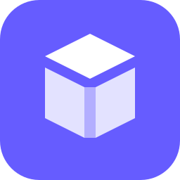

<div align="center">
  

  <h1>Open Inventory</h1>

  <p><strong>Self-hosted inventory and stock management for teams, spaces, and physical things.</strong></p>

  <p>
    <a href="https://github.com/Utzel-Butzel/inventory/actions/workflows/deployment-check.yml"></a>
    <a href="./LICENSE"></a>
    <a href="https://github.com/Utzel-Butzel/inventory/pkgs/container/inventory"></a>
  </p>

  <p>
    <a href="#quick-start">Quick start</a> ·
    <a href="#features">Features</a> ·
    <a href="#api-and-integrations">API</a> ·
    <a href="#local-development">Development</a> ·
    <a href="#contributing">Contributing</a>
  </p>
</div>

Open Inventory helps you catalog equipment, supplies, collections, rooms, and
other physical assets. It combines flexible inventory records with auditable
stock workflows, mobile capture, maps, optional AI, and a scoped REST API.

Your data stays on infrastructure you control. The web app, API, migrations,
and native iOS app live in this repository; the public website and product
content live in [open-inventory-website](https://github.com/Utzel-Butzel/open-inventory-website).

## Features

| | |
| --- | --- |
| **Flexible inventory** | Custom types and fields, relationships, tags, media, variants, translations, and CSV/Excel/PDF exchange |
| **Traceable stock** | Bulk and serialized tracking, location balances, counts, assignments, reservations, bills of materials, and purchase orders |
| **Fast capture** | Camera batches, QR and barcode workflows, printable labels, duplicate detection, and a native iPhone app |
| **Maps and rooms** | GPS, GeoJSON points and polygons, spatial containment, LiDAR RoomPlan scans, and indoor 3D placement |
| **Optional AI** | Image analysis, item recognition, photo counting, cover generation, and content translation |
| **Built for teams** | Isolated organizations, custom roles, conditional access, Auth0, notifications, API tokens, and signed webhooks |

### Organizations

Users can belong to multiple isolated organizations and have a different role
in each one. Authenticated Webapp pages use a short, editable organization slug
as the first URL segment, for example
`https://inventory.example.com/workshop-berlin/inventory`. Legacy UUID URLs
redirect to the current slug, so existing links remain valid.
API and iOS clients select a membership with `X-Organization-ID`; standalone
API tokens remain pinned to the organization that issued them. Manage and
switch organizations under **Settings → Organization**.

## Quick start

You need Git, Docker with Compose v2, OpenSSL, and `curl`.

```bash
git clone https://github.com/Utzel-Butzel/inventory.git
cd inventory
./scripts/install.sh
```

The installer generates unique secrets, starts PostgreSQL and Open Inventory,
runs migrations, waits for the health check, and prints the sign-in details.
Open [http://localhost:3000](http://localhost:3000) unless you selected another
URL.

> [!IMPORTANT]
> After the first sign-in, change the generated password under **Settings →
> Users**. Then remove `BOOTSTRAP_ADMIN_PASSWORD` and
> `BOOTSTRAP_ADMIN_PASSWORD_ONCE` from `.env` and restart the stack.

Use a different port or public URL when needed:

```bash
APP_PORT=8080 ./scripts/install.sh
AUTH_URL=https://inventory.example.com ./scripts/install.sh
```

The installer never overwrites an existing `.env`. Start an already configured
installation with:

```bash
docker compose -f docker-compose.yml -f docker-compose.local.yml up -d --build
```

PostgreSQL data and uploads use persistent Docker volumes. Avoid
`docker compose down --volumes` unless you intend to delete both.

## Deployment options

### Docker Compose

The [quick start](#quick-start) is the recommended setup for a single server.
Put a TLS reverse proxy in front of it and set `AUTH_URL` to the exact public
origin.

### Dokploy

Import the ready-made PostgreSQL and app bundle using the
[Dokploy deployment guide](deploy/dokploy/README.md).

### Coolify

Paste the service definition from the
[Coolify deployment guide](deploy/coolify/README.md).

### iOS / TestFlight

The native iOS app is deployed with the repository's pinned Fastlane version.
After the one-time App Store Connect and Xcode signing setup described in the
[iOS deployment guide](ios/Inventory/README.md#testflight-deployment), deploy a
new build from the repository root with:

```bash
npm run deploy
```

This builds a signed IPA and uploads it to TestFlight. It does not submit an App
Store version for review. Use `npm run ios:check` for a local configuration
check of the project and shared scheme, or `npm run ios:build` to create the IPA
without uploading it.

Both platform templates include migrations, health checks, generated secrets,
and persistent database and upload volumes. They use the published
[`ghcr.io/utzel-butzel/inventory`](https://github.com/Utzel-Butzel/inventory/pkgs/container/inventory)
image.

<details>
<summary><strong>Common operations</strong></summary>

Verify the application and database are ready:

```bash
curl --fail http://localhost:3000/api/health
docker compose -f docker-compose.yml -f docker-compose.local.yml ps
```

Update a checkout:

```bash
git pull --ff-only
docker compose -f docker-compose.yml -f docker-compose.local.yml up -d --build
curl --fail http://localhost:3000/api/health
```

Back up the database and local uploads in the same maintenance window:

```bash
mkdir -p backups
docker compose -f docker-compose.yml -f docker-compose.local.yml exec -T db \
  pg_dump -U inventory -d inventory -Fc > backups/inventory.dump
docker compose -f docker-compose.yml -f docker-compose.local.yml exec -T app \
  tar -czf - -C /app/data/uploads . > backups/inventory-uploads.tar.gz
```

Store both backup files away from the Docker host and test restoring them.

</details>

## Configuration

The installer creates the required values. Optional services remain disabled
until configured in `.env`.

| Area | Main settings |
| --- | --- |
| Authentication | Local accounts by default; optional `AUTH0_*` settings |
| Storage | Persistent local files or `OPENINARY_*` |
| Maps | Token-free defaults or `NEXT_PUBLIC_MAPBOX_ACCESS_TOKEN` |
| AI | `OPENAI_API_KEY`, `REPLICATE_API_TOKEN`, or `GOOGLE_AI_API_KEY` |
| Notifications | In-app by default; optional SMTP, Web Push, Slack, Teams, or webhook delivery |
| Integrations | Scoped API tokens and HMAC-signed outgoing webhooks |

See [`.env.example`](.env.example) for the complete, commented reference.

## Local development

Requirements: Node.js 22.13+, npm, and PostgreSQL 15+.

Create the development database once:

```bash
psql postgres -c "CREATE ROLE inventory LOGIN PASSWORD 'inventory';"
createdb --owner=inventory inventory
```

Then install and start the app:

```bash
npm ci
cp .env.example .env.local
npm run db:migrate
npm run db:seed       # optional sample data
npm run dev
```

For a local password login, add these values to `.env.local`:

```dotenv
BOOTSTRAP_ADMIN_EMAIL=admin@inventory.local
BOOTSTRAP_ADMIN_NAME=Inventory admin
BOOTSTRAP_ADMIN_PASSWORD=choose-a-local-only-password
```

Open [http://localhost:3000](http://localhost:3000).

### Useful commands

| Command | Purpose |
| --- | --- |
| `npm run dev` | Start the development server |
| `npm run build` | Create a production build |
| `npm run lint` | Run ESLint |
| `npm run typecheck` | Run generated-route and TypeScript checks |
| `npm run db:migrate` | Apply checked-in migrations |
| `npm run db:seed` | Add sample records to an empty workspace |
| `npm run db:generate` | Generate a Drizzle migration |
| `npm run db:tunnel` | Open an SSH tunnel to a remote PostgreSQL server |
| `npm run auth:hash -- "password"` | Generate a bcrypt password hash |
| `npm run deploy` | Build and upload the native iOS app to TestFlight |

Focused contract and integration test commands are listed in
[`package.json`](package.json).

## API and integrations

Create a scoped token under **Settings → API access**, then use it as a bearer
credential:

```bash
curl "http://localhost:3000/api/v1/resources?pageSize=25" \
  -H "Authorization: Bearer inv_your_token"
```

Tokens can receive `read`, `write`, and `ai` scopes and can be revoked at any
time. A running installation exposes the machine-readable contract at
`/openapi.json`; set `WEBSITE_URL` to link the app to the separate website's
interactive documentation.

- [OpenAPI specification](public/openapi.yaml)
- [Native iOS app and setup guide](ios/Inventory/README.md)
- Outgoing webhooks are configured under **Settings → Webhooks**

## Project structure

| Path | Contents |
| --- | --- |
| `app/` | Next.js pages and API routes |
| `components/` | Web interface components |
| `lib/` | Domain logic and integrations |
| `db/` | Drizzle schema and PostgreSQL migrations |
| `ios/Inventory/` | Native SwiftUI client |
| `deploy/` | Dokploy and Coolify templates |
| `public/openapi.yaml` | REST API contract |

The main stack is Next.js, React, TypeScript, Tailwind CSS, PostgreSQL, and
Drizzle ORM. Spatial views use MapLibre and Three.js.

## Contributing

Contributions and bug reports are welcome.

1. Create a focused branch.
2. Make the change and add or update relevant tests.
3. Run `npm run lint`, `npm run typecheck`, and the affected test suites.
4. Open a pull request with a concise description and verification notes.

For larger changes, opening an
[issue](https://github.com/Utzel-Butzel/inventory/issues) first helps align the
scope.

## License

Open Inventory is available under the [MIT License](LICENSE).
